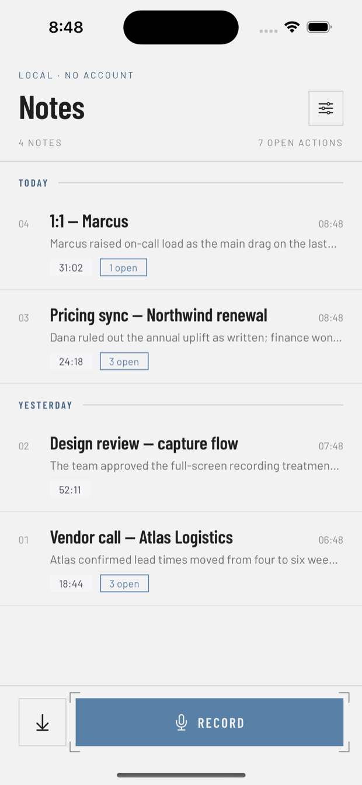
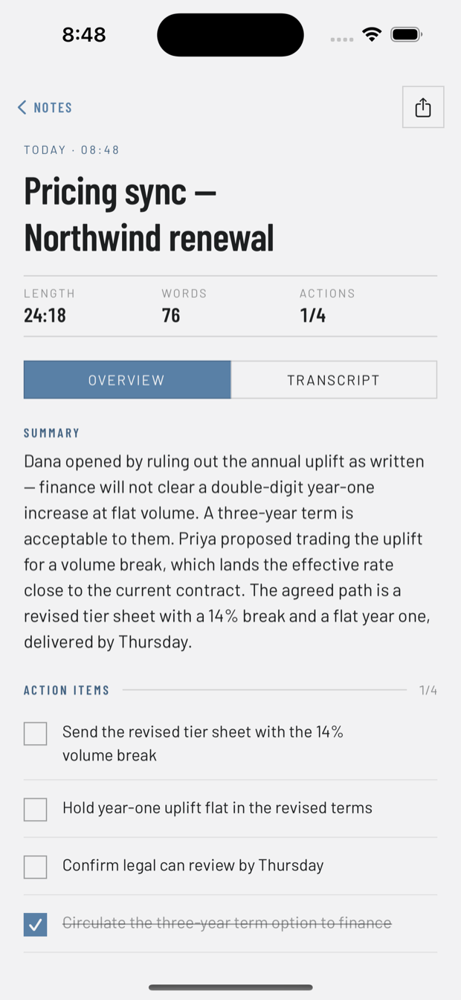
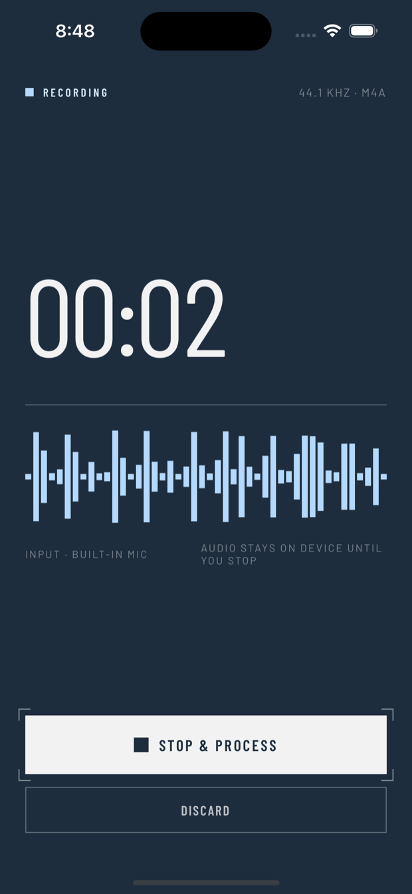
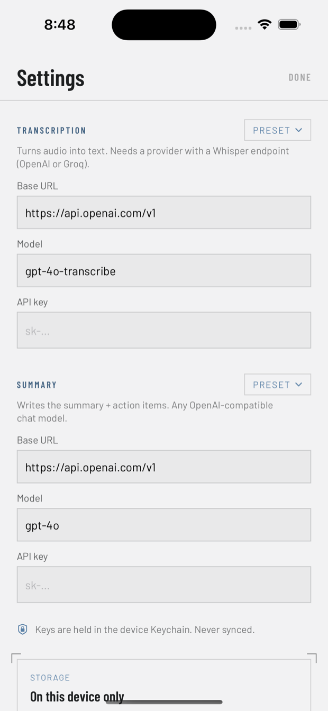

# Meeting Notes

A private, native iOS app that turns a conversation into a clean note. Record a
meeting (or import a video/audio file), and get back a **transcript**, an **AI
summary**, and a **checklist of action items** — stored on your phone, running
on **your own** API key.

No account. No backend of ours. You bring the key; you pick the provider.

## Screenshots

<p align="center">
  
  
  
  
</p>
<p align="center"><sub>Capture log · note detail · recording · provider settings</sub></p>

---

## What it does

- **Record** audio in-app, or **import** a video/audio file from Photos or Files
  (video has its audio extracted first).
- Transcribe → summarize into a title, a prose summary, and action items.
- Browse past notes grouped by day; tick off action items; copy or share any part.
- Everything is saved locally with SwiftData; your API keys live in the Keychain.

## Privacy & where your data goes

This matters, so it's stated plainly:

- **Notes are stored only on your device.** There is no server operated by this
  app, no account, and no analytics.
- **Transcription and summarization are cloud calls.** To transcribe, your
  **audio** is uploaded to the transcription provider you configure. To
  summarize, the resulting **transcript text** is sent to the summary provider
  you configure. Nothing else leaves the device.
- You choose those providers. If you want audio to never leave your device,
  point the summary step at a local model and use on-device transcription
  (not yet built in — see [Ideas](#ideas)).
- API keys are stored with `kSecAttrAccessibleWhenUnlockedThisDeviceOnly`: kept
  out of backups, never synced, readable only while the device is unlocked.

## Supported providers

The app talks to **any OpenAI-compatible endpoint** — a provider is just a base
URL + key + model. Transcription and summary are configured **independently**
(not every provider offers audio).

| Step          | Works with                                                            |
| ------------- | -------------------------------------------------------------------- |
| Transcription | Any provider with a Whisper-style `/audio/transcriptions` endpoint — **OpenAI**, **Groq** |
| Summary       | Any `/chat/completions` provider — **OpenAI**, **Groq**, **DeepSeek**, **Qwen**, **OpenRouter**, **Together**, local Ollama via a custom URL, … |

One-tap presets for the common ones are built in; anything else is a base URL +
model you paste in Settings. Summaries use JSON-object mode with lenient parsing,
so models that don't support strict schemas still work.

## Requirements

- macOS with **Xcode 16.2+**
- **iOS 17+** device or simulator
- [**XcodeGen**](https://github.com/yonaskolb/XcodeGen) — `brew install xcodegen`
  (the Xcode project is generated from `project.yml`)
- At least one API key for an OpenAI-compatible provider

## Build & run

```bash
xcodegen generate          # regenerate MeetingNotes.xcodeproj from project.yml
open MeetingNotes.xcodeproj
```

Then in Xcode:

1. Select the **MeetingNotes** target → **Signing & Capabilities** → check
   *Automatically manage signing* and pick your **Team**.
   (Signing is not stored in `project.yml`, so you re-select it after any
   `xcodegen generate`.)
2. Pick a device/simulator and press **⌘R**.
3. On first launch, add your API key(s) in **Settings**.

To build for the simulator from the command line:

```bash
xcodebuild -project MeetingNotes.xcodeproj -scheme MeetingNotes \
  -sdk iphonesimulator -destination 'platform=iOS Simulator,name=iPhone 16' \
  build CODE_SIGNING_ALLOWED=NO
```

## Configuration

Open **Settings** in the app. There are two independent endpoints:

- **Transcription** — Base URL, model, and key (default: OpenAI `gpt-4o-transcribe`).
- **Summary** — Base URL, model, and key (default: OpenAI `gpt-4o`).

Each has a **Preset** menu that fills the base URL and a sensible default model;
you can override any field. Example: transcribe on Groq Whisper, summarize on
DeepSeek — two different providers, two keys.

## How it works

- **UI** — SwiftUI, in the "Industry" blueprint style (bundled Barlow /
  Barlow Condensed fonts).
- **Storage** — SwiftData (`Note`, `ActionItem`), local only.
- **Audio** — `AVAudioRecorder` for recording; `AVAssetExportSession` extracts
  and compresses audio from imported video (25 MB upload cap).
- **Services** — `TranscriptionService` and `SummaryService` are thin
  OpenAI-compatible clients; `NoteProcessor` runs the transcribe → summarize
  pipeline and reports progress.
- **Secrets** — `KeychainStore` holds the API keys.

```
MeetingNotes/
  App/         app entry + root
  Models/      SwiftData models
  Services/    OpenAI-compatible clients, settings, Keychain
  Audio/       recorder + audio extraction
  Views/       screens + design system
  Fonts/       bundled Barlow (OFL)
```

## Good to know

- Notes aren't behind a separate app lock — anyone with your unlocked phone can
  read them. A Face ID gate is a reasonable addition.
- "Copy" writes to the system clipboard (readable by other apps, synced via
  Universal Clipboard).
- Transcription providers cap uploads around 25 MB (~25–30 min of audio); longer
  recordings show a clear error.

## Ideas

- On-device transcription (Apple Speech / a local Whisper) so audio can stay on
  the phone.
- Optional Face ID lock; a cross-note "Actions" view; speaker labels.

## License

MIT — see [LICENSE](LICENSE). The bundled Barlow fonts are under the SIL Open
Font License 1.1.

Built as an experiment in directing AI tools end to end — with
[Claude Code](https://claude.com/claude-code) for the code and
[Claude Design](https://claude.ai/design) for the look.
